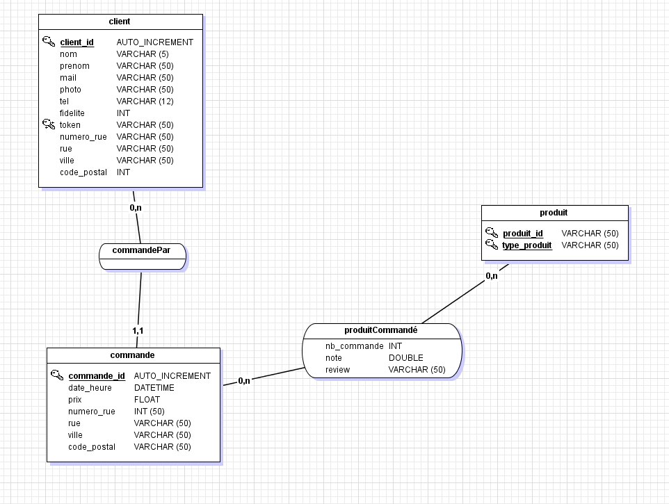

# Lisez-moi du projet intégrateur de L3 MIAGE du groupe 1
Étudiants :
- Jolan DAUMAS - 11614043
- Loïc JOVANOVIC - 10207151
- Maxence MORAND - 11620508
- Romain BAILLS - 11601334
- Thibault BLAYE - 11614189
 
## Back end

### Base de données
Le projet nécessite une base de données mySql nommée `projetfinal`.
Pour configurer la base de données, il faut:
- Éxécuter le fichier `createTable.sql` pour créer les tables,
- Il éxiste un fichier dropTable.sql pour delete les tables,
- Éxécuter le fichier insertProductPL.sql pour créer la procédure,
- Éxécuter le fichier reviewAverage.sql pour créer la fonction.
Pour se connecter à la base de données il faut mettre ses identifiants et mot de pass dans le fichier `/serveur/.properties` sous la forme :

> user={nom d'utilisateur}  
password={mot de passe}
    
Voici le MCD (Modèle Conceptuel des Données) schéma de notre application:

 	
 
Nous avons fait le choix de stocker les id's et le type du produit dans la base de données,
pour différencier les films, de la nourriture et des menus.
Pour cela nous utilisons une table qui contient l'id du produit et son type parmis ('Film','Nourriture','Menu'),
Le choix de mettre le type du produit dans la clef de produit a été fait parce qu'on ne connait pas le domaine exacte
des identifiants. 

Vous pouvez vous connecter aussi bien sur une Base de Données local que sur une Base de Données distante.
Pour vous connecter sur l’un ou sur l’autre il faut modifier le fichier `/l3m_menucinema/serveur/src/main/java/services/Connection.java`:  

#### Pour vous connecter en local
Changez la ligne 29 : 
> `conn = DriverManager.getConnection(CONN_URL_REMOTE, Properties.user, Properties.password);`  
  
Par :  
> `conn = DriverManager.getConnection(CONN_URL_LOCAL, Properties.user, Properties.password);`  
  
#### Pour vous connecter à distance  
Changer la ligne 29 :   
> `conn = DriverManager.getConnection(CONN_URL_LOCAL, Properties.user, Properties.password);`  
  
Par :  
> `conn = DriverManager.getConnection(CONN_URL_REMOTE, Properties.user, Properties.password);`  
  
  
  
  
### JAVA  
        maven  
        ?? à voir avec les autres ??  
## End points
###Client  

L'end point pour avoir les détails pour un client est  GET `/api/client`    
**Paramètre**:  
`token`: Chaîne de caractères contenant le token firebase du client.    

**Réponse**:     
Code : 200 OK    
Content-type: json    
Content:    

Identifiant | Description    
|---|---|    
`clientId`| Entier  
`nom`| Chaîne de caractères  
`prenom`| Chaîne de caractères  
`mail`| Chaine de caractères  
`photo`| Chaîne de caractères  
`fidelite`| Entier  
`token`| Chaîne de caractères  
`numeroRue`| Entier  
`rue`| Chaine de caractères  
`ville`| Chaîne de caractères
`codePostal`| Chaîne de caractères  

  ----------------
### Produits

Le end point pour avoir le détail d’une liste de produits est GET `/produitsIds`  
**Paramètres**:  
`ids`: liste d’entiers séparés par des points-virgules  

**Réponse**:   
Code : 200 OK  
Content-type: json  
Content:  

Identifiant | Description  
|------------|----------------|  
`product`| un tableau de produitItem  
`menu`| un tableau de menuItem  
  
produitItem :   

Identifiant | Description  
|------------|----------------|  
`id`|Chaîne de caractères  
`type`|Chaîne de caractères  
`description`| Chaîne de caractères  
`prix`| Entier  
`ingredients`| Tableau de chaînes de caractères  
  
menuItem:   

Identifiant | Description  
|------------|----------------|  
`id`|Chaîne de caractères  
`type`|Chaîne de caractères  
`prix`| Entier  
`fooGroups`| Contient un objet nommé `product` contenant un tableau de produitItem  
  
  ----------------
### Commande  
 
#### Le end point pour créer une commande est POST `/addCommande`  
**Parametres**:  
`client_id`: l’id du client  
`prix`: le prix de la commande  
`date_heure`: la date et l’heure de la commande  
`numero_rue`: le numéro de rue de la livraison  
`rue`: la rue de livraison  
`ville`: la ville de livraison  
`code_postal`: code postal de l’adresse de livraison  
  
#### Le end point pour avoir les détails pour une commande est  GET `/commande`  
**Parametres**:  
`id`: l’id de la commande souhaité.  
**Réponse**:   
Code : 200 OK  
Content-type: json  
Content:  

Identifant | Description  
|------------|----------------|  
`commande_id`| Entier  
`date_heure`| Datetime  
`prix`| Décimale   
`numero_rue`| Chaine de caractères  
`rue`| Chaîne de caractères  
`ville`| Chaîne de caractères  
`code_postal`| Chaîne de caractères  
`client_id`| Entier  

## FRONT
### npm
Pour installer le **front-end** il faut installer les dépendances nécessaires. Cela se fait l'exécution de la commande `npm install` dans le même dossier que le fichier `/client/packages.json` .  
Après l’installation terminée vous pouvez à présent lancer le serveur avec la commande `npm start` (toujours au même endroit).  
Après l'exécution réussie de ces deux commande l’application est disponible à l’adresse `<localhost:4200>`.  
## Routing  
L’application propose plusieurs pages :  
la page d’acceuil : `/homepage`  
la page de connection : `/login`  
la page de consultation/modification du profil : `/profile`  
la page de detail de film: `/movie`  

Voici un schéma pour la représenté, celui-ci est non exhaustif mais présente les composants les plus importants.

 	s